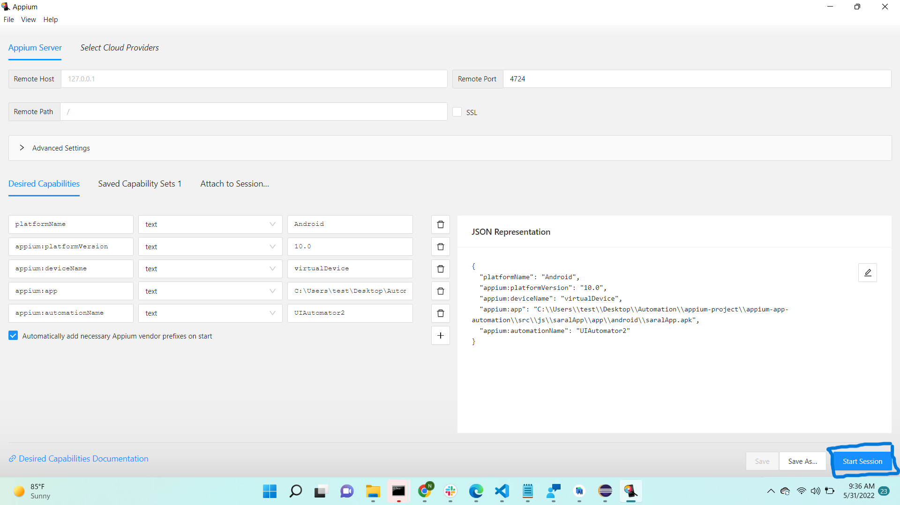
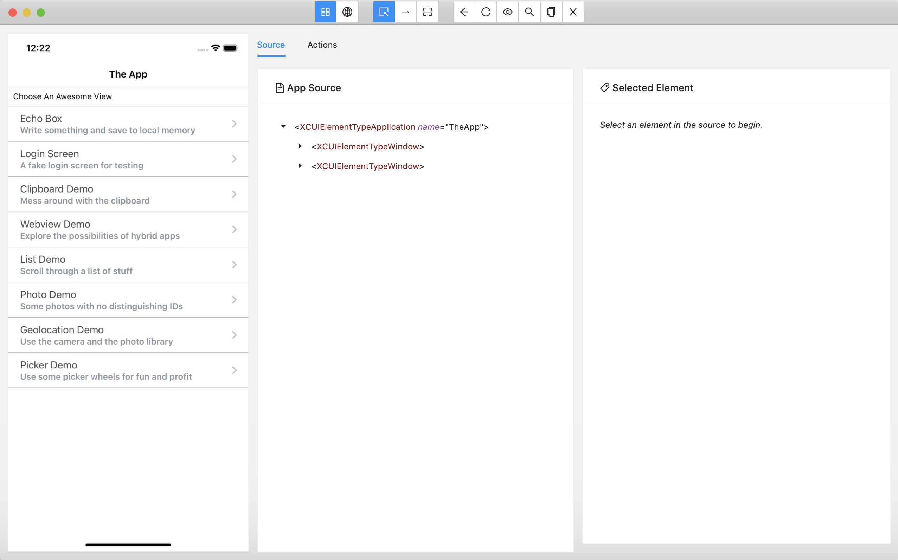
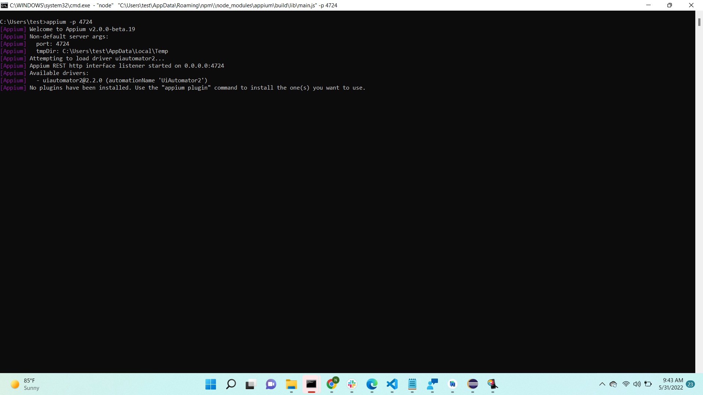
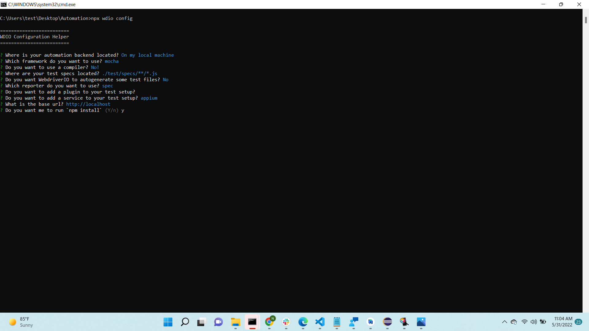

# Mobile App Test Automation reference repository with [Appium](https://appium.io/) , [WebdriverIO](https://webdriver.io/docs/what-is-webdriverio/) , [Mocha](https://mochajs.org/).
### This repository demonstrates Android mobile app testing with a demoApp and SaralApp.

# Environment Setup
***
## NODE
Install [Node v16](https://nodejs.org/en/). Not the latest version,as that is not compatible as of now with WebdriverIO & Appium.

### JAVA
Install Java and set environmental path (JAVA_HOME) in system.

### ANDROID STUDIO
Download Android Studio and set sdk environmental path (ANDROID_HOME) in system

[Android Studio](https://developer.android.com/studio?gclid=Cj0KCQjw1tGUBhDXARIsAIJx01k1SwKk4eZMrougAzm54UrdXzHS0x291s0WfN8HrGJQPdx5SMq_C5AaAgAGEALw_wcB&gclsrc=aw.ds)

### ANDROID EMULATOR
The Android Emulator simulates Android devices on your computer so that you can test your application on a variety of devices and Android API levels without needing to have each physical device.
[Android emulator](https://developer.android.com/studio/run/emulator)

### APPIUM INSPECTOR setup 

A GUI inspector for mobile apps and more, powered by a (separately installed) Appium server.its desired capabilities.

A GUI inspector for mobile apps and more, powered by a (separately installed) Appium server. When you're using it to inspect a mobile app, it looks like this:

Appium Inspector is basically just an Appium client (like WebdriverIO, Appium's Java client, Appium's Python client, etc...) with a user interface. There's an interface for specifying which Appium server to use, which capabilities to set, and then interacting with elements and other Appium commands once you've started a session.

### APPIUM Setup
install version 2.0 and above run command

`npm i -g appium@2.0.0-beta.19`

Now to verify if its dependencies installed using below command

Install : `npm install -g appium-doctor`

Run in terminal to verify : `appium-doctor`

### APPIUM DRIVER Setup
`appium driver install uiautomator2`

Now to verify if its been installed by running `appium driver list` from terminal.

After setup, you can start the appium server and start inspect element of the app

`appium -p 4724`

### WebdriverIO Setup

Navigate to project directory and run below commands:

   1.   `npm init`

After run above command, it will prompt to enter below info. Please follow below instructions.

> package name (make it default by press enter key)

> version (make it default by press enter key)

> description (what ever you want to give)

> entry point (make it default index.js by press enter)

> test command (make it default by press enter key)

> git repository (give repository link if any there)

> keyword (you can give webdriverIO, appium)

> author (you can give your name)

> licence (make it default by press enter key)

  
 2. `npm install @wdio/cli` command installs webdriverIO CLI

 3. `npx wdio config`

   After run above command , it will prompt with below options. Choose as instructed below or as applicable.

? Where is your automation backend located?  **On my local machine**

? Which framework do you want to use?  **mocha**

? Do you want to use a compiler? **No!**

? Where are your test specs located? **./test/specs/**/*.js**

? Do you want WebdriverIO to autogenerate some test files? **No**

? Which reporter do you want to use? **spec**

? Do you want to add a plugin to your test setup?

? Do you want to add a service to your test setup? **appium**

? What is the base url? **http://localhost**

? Do you want me to run `npm install` (Y/n) **y**

 

 4. `npm i appium@2.0.0-beta.19`
   
 5. `npm i @wdio/appium-service@7.13.2`

 Update [wdio.conf.js ](/wdio.conf.js) file as applicable.
 

***
### Install App and run tests
1. To install App and run the tests execute `npx wdio` from the terminal.
2. You can also start your test suite by using the run command and pointing to the WebdriverIO config:`npx wdio run ./wdio.conf`.js
3. If you like to run specific test files you can add a --spec parameter and execute: `npx wdio {config} --spec {filepath}`

***
### find elements syntax
1. by class => await $('//*[@text="value"]') or await $("//android.widget.TextView[@text='value']")
2. by resource id => await $('//*[@resource-id="value"]')
3. by accessibility id => await $('~value');

### if emulator not opened our test app then execute this command in terminal
 1. adb uninstall io.appium.uiautomator2.server
 2. adb uninstall io.appium.uiautomator2.server.test

